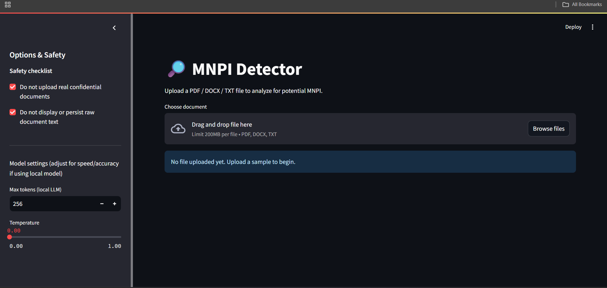
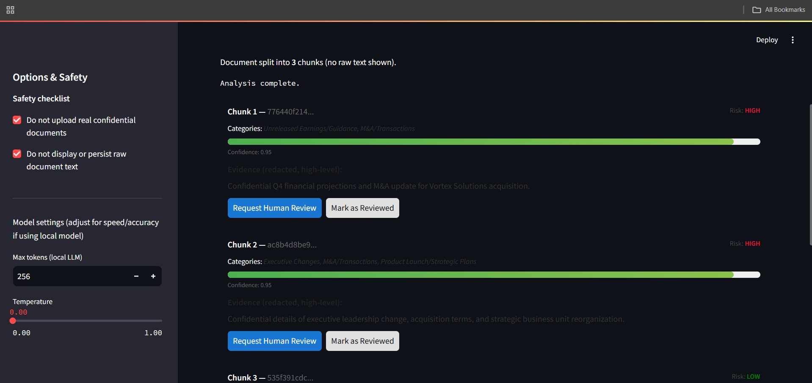
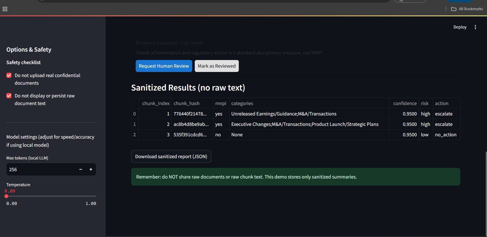
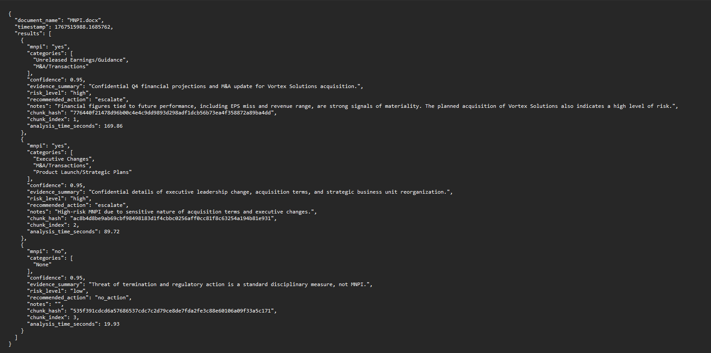

# 🔎 MNPI Detector

An AI-powered agent that automatically detects **Material Non-Public Information (MNPI)** in documents to help organizations maintain regulatory compliance and prevent insider trading risks.

## 🌐 Live Demo

**Try it now:** [https://mnpi-agent.streamlit.app/](https://mnpi-agent.streamlit.app/)

## 📋 Overview

The MNPI Detector analyzes documents (PDF, DOCX, TXT) to identify sensitive information that could affect securities trading decisions. It uses a local Large Language Model (LLaMA 3.1 via Ollama) to classify content chunks based on strict MNPI definitions, ensuring privacy and data security by processing everything locally.

### What is MNPI?

MNPI (Material Non-Public Information) refers to confidential information about a company that:
- Has not been publicly disclosed
- Would likely affect the company's stock price or investor decisions
- Examples: unreleased earnings, M&A negotiations, regulatory investigations, executive changes, confidential financial projections

## ✨ Features

- **🔒 Privacy-First**: All processing happens locally using Ollama - no data sent to external APIs
- **📄 Multi-Format Support**: Analyzes PDF, DOCX, and TXT files
- **🧠 Intelligent Classification**: Uses LLaMA 3.1 with custom prompts to detect MNPI with confidence scores
- **📊 Risk Assessment**: Categorizes findings by risk level (low/medium/high) and recommends actions
- **🎨 Interactive UI**: Modern Streamlit interface with real-time analysis progress
- **🔐 Data Redaction**: Automatically redacts sensitive numbers and dates in summaries
- **💾 Export Reports**: Download sanitized JSON reports for compliance records
- **🔄 Retry & Verification**: Multi-pass analysis with verifier for borderline cases

## 🛠️ Tech Stack

- **Language**: Python 3.12
- **LLM Framework**: LangChain + LangChain-Ollama
- **Local LLM**: Ollama (LLaMA 3.1 model)
- **UI Framework**: Streamlit
- **Document Processing**: 
  - `pypdf` for PDF extraction
  - `docx2txt` for Word documents
  - `langchain-text-splitters` for intelligent chunking
- **Environment Management**: python-dotenv

## 🚀 Setup Instructions

### Prerequisites

- Python 3.8 or higher
- Windows/Linux/macOS
- 8GB+ RAM recommended for running LLaMA 3.1

### Step 1: Clone the Repository

```bash
git clone <your-repo-url>
cd mnpi-agent
```

### Step 2: Install Python Dependencies

```bash
pip install -r requirements.txt
```

This installs:
- langchain
- langchain-openai
- langchain-ollama
- pypdf
- docx2txt
- python-dotenv
- streamlit

### Step 3: Install Ollama

1. Go to [https://ollama.com/download](https://ollama.com/download)
2. Download and install Ollama for your operating system
3. Restart your terminal/command prompt after installation

### Step 4: Download the LLaMA 3.1 Model

```bash
ollama pull llama3.1
```

This downloads the LLaMA 3.1 model locally (~4-7GB depending on the variant).

### Step 5: Run the Application

#### Option A: Streamlit Web Interface (Recommended)

```bash
python -m streamlit run streamlit_app.py
```

Then open your browser to:
- Local URL: http://localhost:8501
- Network URL: http://192.168.x.x:8501

#### Option B: Command Line Interface

```bash
python app.py
```

(Note: You may need to modify `app.py` to accept command-line arguments for your document path)

## 📖 How to Use

### Using the Streamlit Interface:

1. Launch the app: `python -m streamlit run streamlit_app.py`
2. Upload a document (PDF, DOCX, or TXT)
3. The app will:
   - Split the document into chunks
   - Analyze each chunk for MNPI content
   - Display results with confidence scores and risk levels
   - Provide redacted evidence summaries
4. Review the results and download the sanitized JSON report

## 📸 Screenshots

### Home Page
Upload your document to get started with MNPI detection.



### Document Processing
The app chunks your document and analyzes each section for MNPI content.



### Analysis Results
View detailed MNPI classification results with confidence scores and risk levels.



### Export Report
Download a sanitized JSON report for compliance records.



### Understanding the Results:

Each analyzed chunk shows:
- **MNPI Status**: yes/no/unclear
- **Categories**: Unreleased Earnings, M&A, Executive Changes, etc.
- **Confidence Score**: 0.00-1.00 (model's certainty)
- **Risk Level**: low/medium/high
- **Recommended Action**: escalate/human_review/no_action
- **Evidence Summary**: High-level reason (redacted)

## 🏗️ Project Structure

```
mnpi-agent/
├── app.py                 # CLI entry point
├── streamlit_app.py       # Streamlit web UI
├── classifier.py          # Core MNPI classification logic with LLM
├── analyzer.py            # Document analysis orchestration
├── aggregator.py          # Results aggregation and summary
├── loaders.py             # Document loading and text chunking
├── requirements.txt       # Python dependencies
└── readme.md              # This file
```

## 🔍 How It Works

1. **Document Loading** (`loaders.py`): Extracts text from PDF/DOCX/TXT files
2. **Text Chunking** (`loaders.py`): Splits documents into ~1500-character chunks with overlap
3. **Classification** (`classifier.py`): 
   - Sends each chunk to LLaMA 3.1 with a structured prompt
   - Model returns JSON with MNPI classification, confidence, categories, and risk
   - Includes retry logic and verification pass for borderline cases
4. **Normalization**: Validates and normalizes LLM output
5. **Aggregation** (`aggregator.py`): Combines chunk results into overall document assessment
6. **Reporting**: Generates redacted summaries and downloadable reports

## 🎯 Use Cases

- **Compliance Teams**: Screen internal documents before sharing
- **Legal Departments**: Identify potential insider trading risks
- **Finance Professionals**: Ensure communications don't leak material information
- **Corporate Communications**: Verify press releases and investor materials
- **M&A Teams**: Classify deal documents by sensitivity

## ⚠️ Important Notes

- **Do NOT upload real confidential documents in demo environments**
- This tool provides AI-assisted detection, not legal advice
- Always have human compliance experts review flagged content
- The system is designed for privacy - no data leaves your machine
- Results should be treated as guidance, not definitive classifications

## 🤝 Contributing

Contributions are welcome! Please ensure any changes maintain the privacy-first approach and improve classification accuracy.

## 📄 License

[Add your license here]

## 🆘 Troubleshooting

### "ollama command not found"
- Make sure Ollama is installed from https://ollama.com/download
- Restart your terminal after installation
- Verify installation: `ollama --version`

### "ModuleNotFoundError: No module named 'langchain_ollama'"
- Run: `pip install -r requirements.txt`
- Ensure you're in the correct Python environment

### Slow analysis
- Ensure LLaMA 3.1 model is fully downloaded: `ollama list`
- Check available RAM (8GB+ recommended)
- Reduce chunk size in loaders.py if needed

---

**Built with ❤️ for financial compliance and data privacy**
